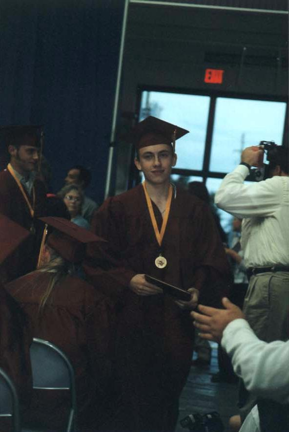
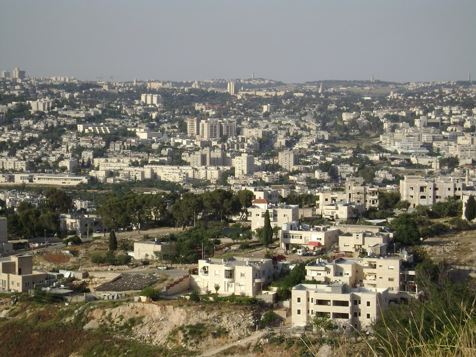
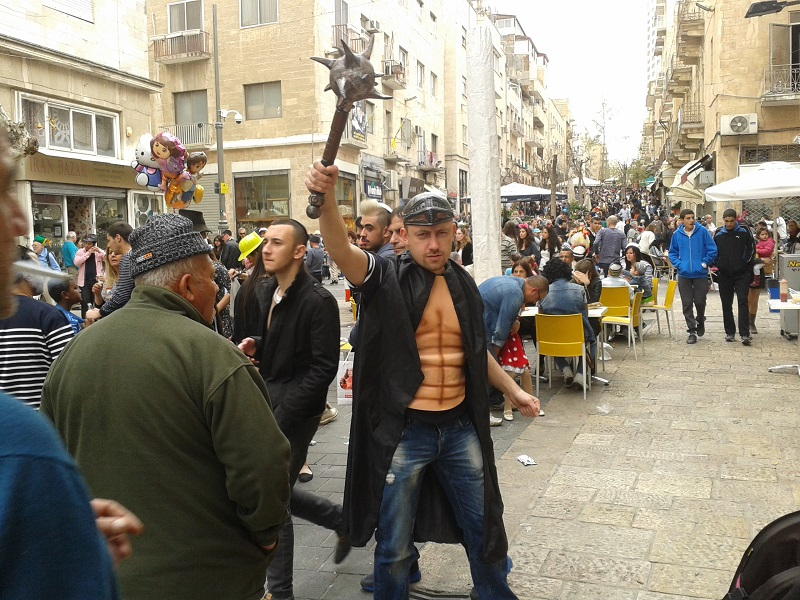
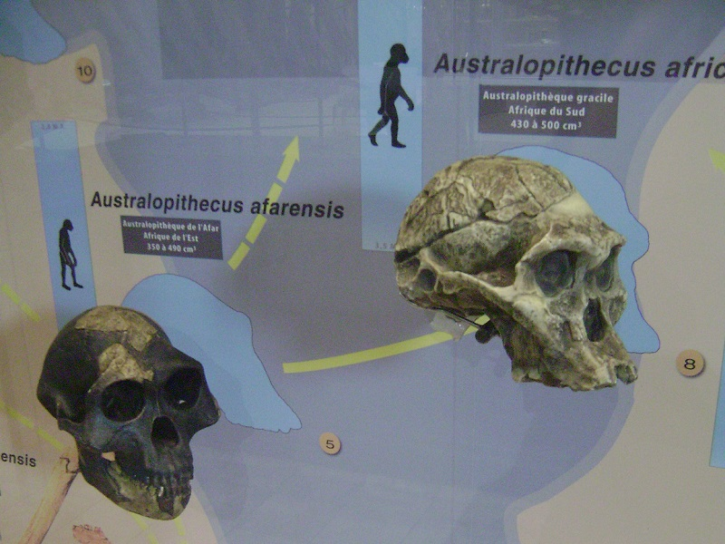
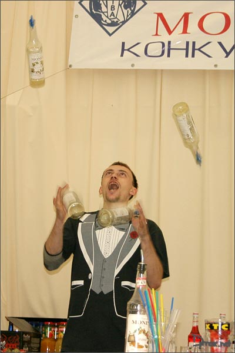
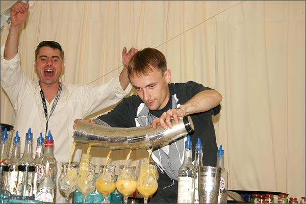
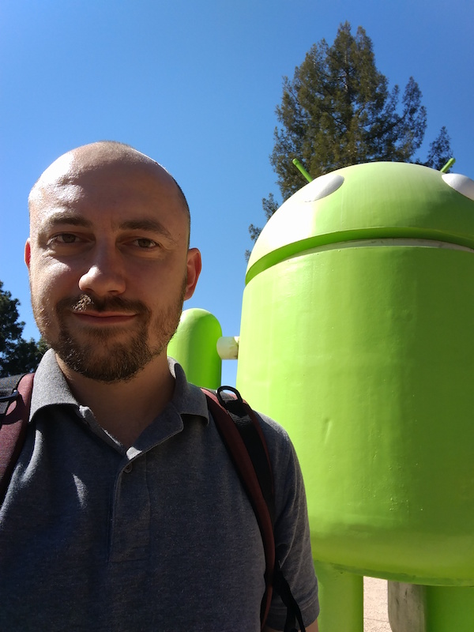

# My bio

Estimated read time: 5 min.

Prerequisites: basic computer knowledge, sense of humor

***

My name is Boris Maximenko.

I was born and raised in [Kazakhstan](https://en.wikipedia.org/wiki/Kazakhstan).

Kazakhstan is famous for being the world's largest [landlocked country](https://en.wikipedia.org/wiki/Landlocked_country) 
and for having popular male names start with BOR.

Such as [Borat](https://en.wikipedia.org/wiki/Borat)

When I was 14 my family moved to Königsberg, because it matches the same pattern (Capital K + 9 random characters) 
and because we like solving problems that involve [bridges](https://en.wikipedia.org/wiki/Seven_Bridges_of_K%C3%B6nigsberg)

By the way this is one of them:

Back in 1999 I was an exchange student in the USA and attended [Prairie High School](https://en.wikipedia.org/wiki/Prairie_High_School_(Vancouver,_Washington)). 
It's probably the best high school in Brush Prairie, WA

At the age of 23 I've moved to [Jerusalem](https://en.wikipedia.org/wiki/Jerusalem), 
because it's in a different time zone (and epoch).

Since then I eat [Kosher food](https://en.wikipedia.org/wiki/Kosher_foods) if I can find it. 
Otherwise, I go into power saving mode.

I don't have a [Mac](https://en.wikipedia.org/wiki/Macintosh) at home, 
because Macs run on [Darwin OS](https://en.wikipedia.org/wiki/Darwin_(operating_system)). 
This guy is not welcome in the Holy Land with his [theories](https://en.wikipedia.org/wiki/Evolution).

By the way the logo was borrowed too:

I have tried myself in different areas. Flipping bottles wasn't a huge success, 
because humans are not designed for [concurrency](https://en.wikipedia.org/wiki/Concurrency_(computer_science)).

Today I'm an Android engineer, because Android is the next big thing. 
Actually, it's the big thing next to me on the photo:

